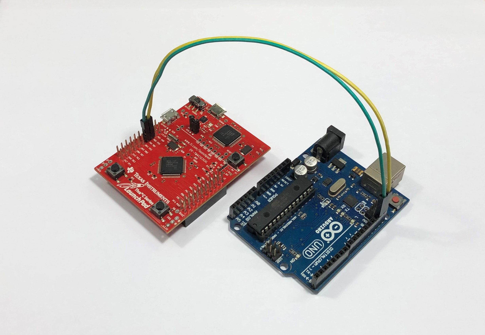

# Tiva-C Launchpad & Arduino UNO I2C Example
A simple example to test I2C module of Tiva-C Launchpad TM4C123GH6PM. An Arduino UNO board is used to test with it.

## Pins Connection
Tiva-C Launchpad       Arduino UNO
I2C3SCL (PD0)     <-->   SCL
I2C3SDA (PD1)     <-->   SDA

For the header file `tm4c123gh6pm.h`, you can find it at this [link](https://github.com/TaLucGiaHoang/SW-TM4C/blob/master/TivaWare_C_Series-2.1.4.178/inc/tm4c123gh6pm.h)